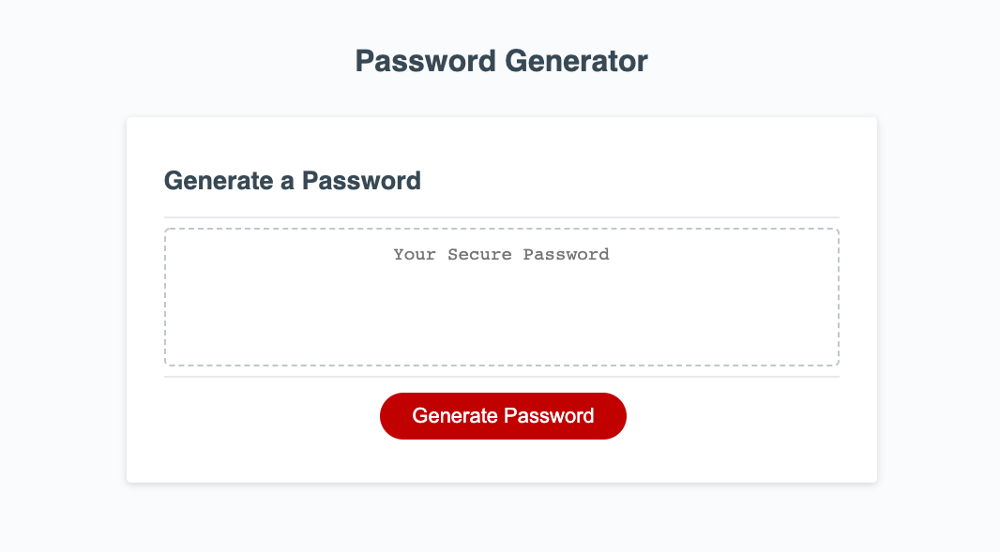

# password-generator
Deployed Application: https://lilicecilia23.github.io/password-generator/

This application generates a random password after asking the user for their desired
password length as well as what characters they want included. After pushing the 'generate'
button, the user will be asked a series of questions about their password specifications.
Once all questions are answered and valid values have been inputed for each field, the program
will generate a random string of characters for the password.

link to repo: https://github.com/LiliCecilia23/password-generator/tree/master/Assets

Technologies Used: HTML, CSS, JavaScript
